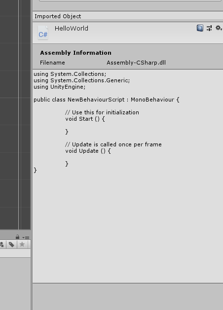
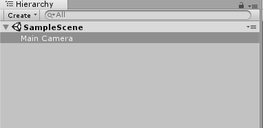
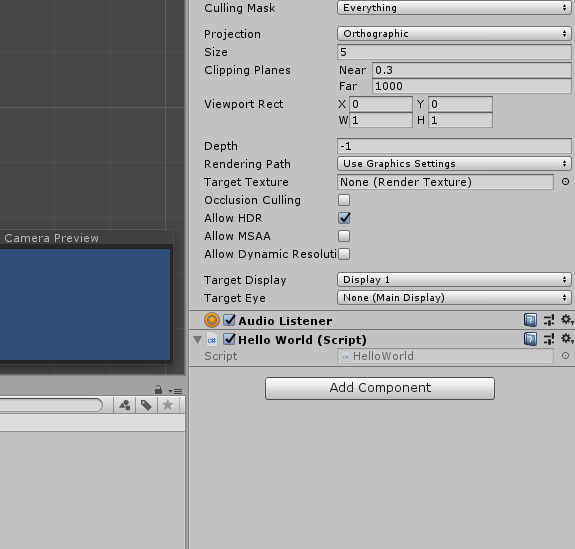

# About Unity
Unity is a game engine for developing 2D, 3D game fast and effective.
The reason is the engine almost handles all the physical related logics, game develop architecture so the developers can only focus on create contents and features for the game only

Unity has 2 big components:
- Unity GUI tool for manages, create and preview game screens, animations, game behaviours,...  
- Visual Studio (IDE) for coding scripts

---

Set layout to 'Default'
When create a new C# file, should defines the name right away after created file. If not the file will create Class with 'NewBehaviourScript' and we have to change the Class name too when renaming C# file name

Ex:

Renaming a file from default to HelloWorld after created file is not automatic update Class name

## To Run a script file, attach it to an object in Unity

